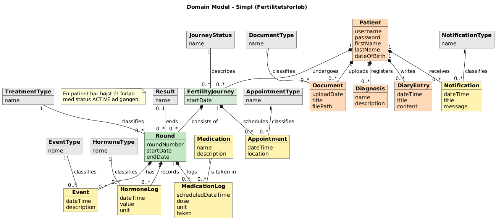
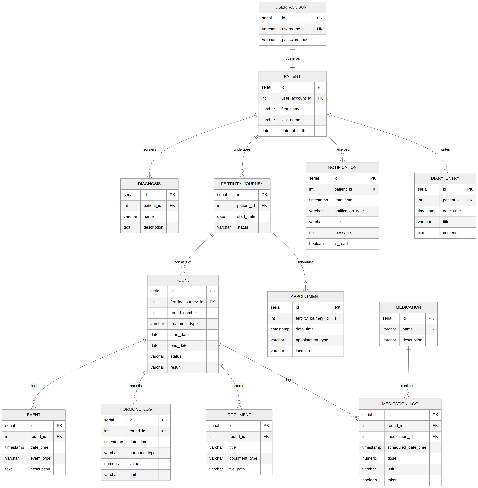
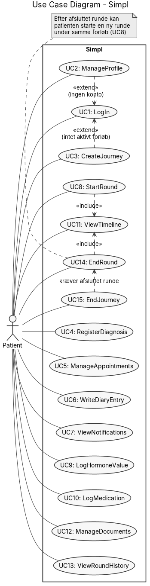
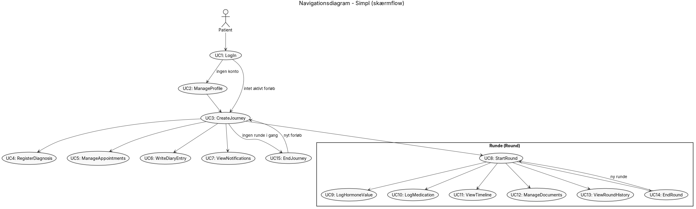
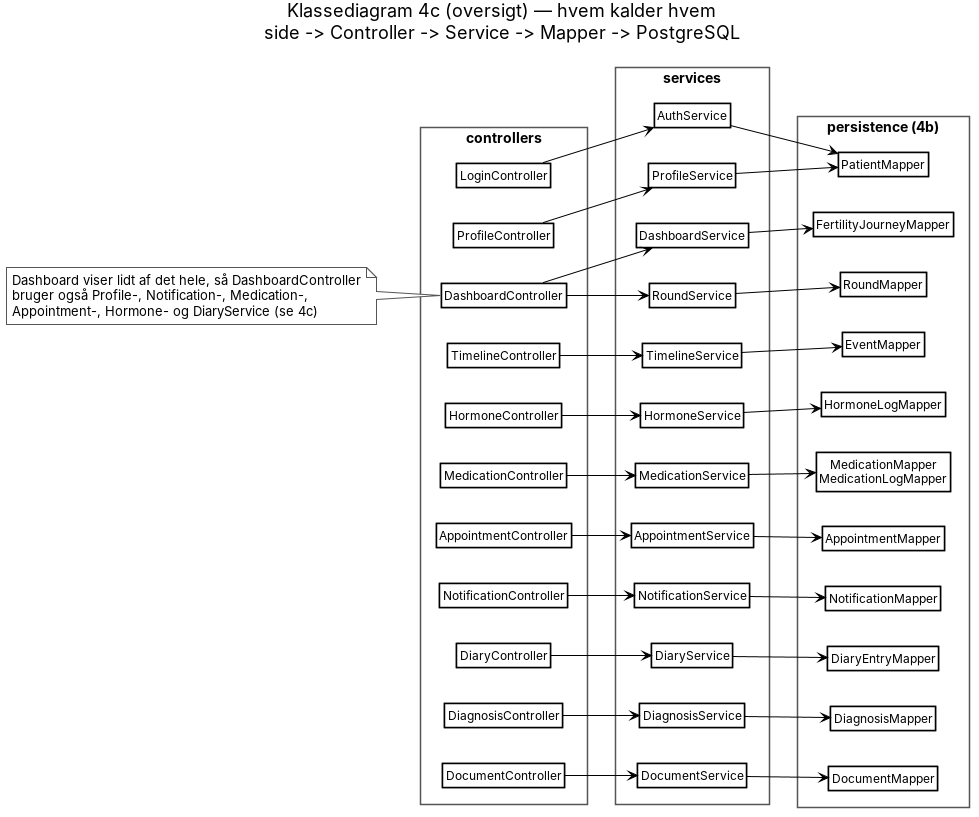

# Simpl

Simpl er et system til patienter, der gennemgår et fertilitetsforløb (fx IVF, ICSI, IUI eller FET), hvor de kan holde styr på deres forløb, diagnoser, aftaler, medicin, hormonværdier, dagbogsnoter, dokumenter og notifikationer.

## Om projektet

Simpl er vores **Pet Project for 2. semester** (Datamatiker, Systemudvikling I). Projektet er en videreudvikling af vores SP4-projekt fra 1. semester, hvor det oprindeligt blev bygget som en JavaFX-desktopapplikation.

**Gruppe:** Besima & Louise

I dette semester bygges det om til et fullstack-system med en hjemmeside som frontend (HTML/CSS/JavaScript) og Javalin som backend, i tråd med semesterets krav til Pet Project. Datamodellen er udvidet med Diagnosis, Medication, Document og Notification, og Round er adskilt fra FertilityJourney, så et forløb kan indeholde flere runder.

## Målgruppe

Patienter der er i gang med et fertilitetsforløb, og som har behov for overblik over status, aftaler, medicin og egne noter/observationer gennem forløbet.

## Funktioner

- **Brugerkonti** — opret profil, log ind, genoptag sit forløb
- **Forløb og runder** — opret forløb, start/afslut runder med resultat, se rundehistorik
- **Dashboard** — overblik over aktiv runde, dagens medicin og nøgletal
- **Hormonlog** — registrering af hormonværdier over tid
- **Medicinlog** — planlagte doser og om de er taget
- **Aftaler** — kommende og tidligere aftaler på klinikken
- **Dagbog** — patientens egne noter
- **Diagnoser** — patientens registrerede diagnoser
- **Dokumenter** — upload af fx blodprøvesvar og behandlingsplaner
- **Tidslinje** — kronologisk overblik over trin i en runde
- **Notifikationer** — påmindelser om dagens medicin

## Status (oktober 2026)

- Frontend: alle 16 sider er Thymeleaf-templates i `templates/` (HTML/CSS/JavaScript). Menuen er ét fælles fragment (`fragments/menu.html`), og siderne virker også, når JavaScript er slået fra
- Database: PostgreSQL med 20 tabeller (inkl. 8 typetabeller), kørt i pgAdmin
- Backend: alle sider virker mod PostgreSQL via controller → service → mapper, med én fælles `ConnectionPool` (HikariCP), der gives videre gennem konstruktørerne
- Kodeord gemmes som BCrypt-hash (mindst 8 tegn)
- Fejl, ingen controller fanger, vises på en fælles fejlside (`fejl.html`)
- Tests: JUnit-tests af alle services i `src/test/java`, sat op mod testdatabasen `Simpl_test` i PostgreSQL (kører fra uge 41)

## Tech stack

- **Java 21**
- **Javalin 7** — webserver/backend (ruter, formularer, statiske filer)
- **Thymeleaf** — templates, der viser data fra databasen (`src/main/resources/templates`)
- **HTML / CSS / JavaScript** — frontend i `src/main/resources/public`
- **PostgreSQL** (via `postgresql`-driveren) — database, kører i Docker og administreres i pgAdmin
- **HikariCP** — connection pool (`ConnectionPool` i `persistence`)
- **jBCrypt** — hashing af kodeord
- **Maven** — byggeværktøj og afhængighedsstyring (standardlayout som i undervisningen)
- **JUnit 5** — unit tests

## Arkitektur

Projektet følger **MVC** (Model-View-Controller) med *separation of concerns*: hvert lag har sit eget ansvar og taler kun med naboen.

```
src/main/java/
├── Main.java              # Laver ConnectionPool, starter Javalin (port 7070) og giver poolen til RouteConfig
├── configuration/         # RouteConfig (laver controllerne), ThymeleafConfig, ExceptionConfig
├── controllers/           # Javalin-ruter: læser formularen, kalder service, vælger side (én per side)
├── services/              # Forretningslogik: regler og mapper-kald, uden Javalin (én per emne) – svarer med ServiceResult
├── entities/              # Model: dataklasser, én per tabel
├── persistence/           # ConnectionPool + mappers: al SQL (én mapper per tabel)
├── exceptions/            # DatabaseException, NoActiveJourneyException, NoActiveRoundException, UserNotFoundException
└── enums/                 # Enums (AppointmentType, HormoneType, TreatmentType …) – matcher navnene i typetabellerne

src/main/resources/
├── public/                # css/, js/ og img/ (hentes direkte af browseren)
└── templates/             # View: alle sider som Thymeleaf-skabeloner (login, dashboard, medicin …)
    └── fragments/         # genbrugte stykker: menu.html (menuen) og besked.html (Gemt ✓ / fejl)

src/test/java/services/    # JUnit-tests af services – kører mod databasen Simpl_test (se TestData.java)
```

Flow for én handling, fx "Gem måling": `hormoner.html` sender formularen (POST) → Javalin finder ruten → `HormoneController` læser felterne og kalder `HormoneService.saveLog()` → service tjekker regler (tomme felter, findes forløb/runde), bygger en `HormoneLog` og kalder `HormoneLogMapper.save()` → service svarer med `ServiceResult` (OK eller en fejl) → controlleren vælger side ud fra svaret.

`ServiceResult` (i `enums`) er én fælles enum for svaret fra alle services: `OK, INVALID_INPUT, ALREADY_EXISTS, NO_ACTIVE_JOURNEY, NO_ACTIVE_ROUND, ROUND_IN_PROGRESS, NOT_FOUND`.

## Database

Databasen er **PostgreSQL** (databasen hedder `Simpl`). Schema og testdata ligger i `doc/database/` og køres i pgAdmin (Query Tool – kopiér filens indhold ind og kør): først `schema_postgres.sql`, derefter `data_postgres.sql` (testdata: 25 patienter med forløb, runder, målinger m.m.). ERD: `doc/database/ERD.mmd`.

**Tabeller (12 + 8 typetabeller):**
- `patient` — login og persondata i én tabel (brugernavn, kodeord-hash, navn, fødselsdato)
- `diagnosis` — patientens diagnoser
- `fertility_journey` — patientens overordnede forløb (kun ét aktivt ad gangen)
- `round` — én behandlingsrunde i et forløb (IVF/ICSI/IUI/FET, status, resultat)
- `appointment` — aftaler på forløbet
- `diary_entry` — patientens dagbogsnoter (hører til patienten, ikke forløbet, så man kan skrive før og efter et forløb)
- `event` — trin i en runde (vises på tidslinjen)
- `medication` — stamdata for lægemidler
- `medication_log` — planlagte doser i en runde, og om de er taget
- `hormone_log` — hormonmålinger i en runde
- `document` — patientens dokumenter, fx henvisning og blodprøvesvar (kun stien og upload-datoen gemmes; hører til patienten, så de kan uploades før første runde)
- `notification` — påmindelser til patienten

**Hver type har sin egen tabel** (20 tabeller i alt): de 12 ovenfor + `journey_status`, `treatment_type`, `result`, `appointment_type`, `event_type`, `hormone_type`, `document_type` og `notification_type` (hver med `id` og `name`). Andre tabeller peger på dem med fx `treatment_type_id`, i stedet for `CHECK`. `round` har ingen status-kolonne: en runde er i gang, så længe `end_date` er tom.

Navnene i typetabellerne matcher enum-klasserne i `enums` og `value` i HTML-dropdowns. Mapperne gemmer ordet (fx `"FSH"`) og lader databasen slå id'et op med `(SELECT id FROM hormone_type WHERE name = ?)`; når der læses, hentes ordet med en `JOIN`.

## Kom i gang

### Forudsætninger

- Java 21 (JDK)
- Maven 3.x
- PostgreSQL (fx i Docker) på `localhost:5432` med brugeren `postgres` / `postgres` og en database, der hedder `Simpl`

### Kør projektet

1. Kør `doc/database/schema_postgres.sql` og derefter `data_postgres.sql` i pgAdmin på databasen `Simpl`.
2. Åbn projektet i IntelliJ og lad Maven hente afhængighederne (Javalin, Thymeleaf, HikariCP, postgresql, jBCrypt).
3. Kør `Main`. Konsollen skriver, at Javalin lytter på port 7070.
4. Åbn `http://localhost:7070` i browseren – du lander på login-siden. Log ind med en testbruger (alle har kodeordet `test1234`, fx `mette1990` / `test1234`), eller opret en ny via "Opret profil".

### Kør testene

1. Opret en tom database i pgAdmin, der hedder `Simpl_test` (højreklik på Databases → Create → Database…).
2. Kør testene i `src/test/java` fra IntelliJ (højreklik → Run 'All Tests') eller med `mvn test`. Testene laver selv tabellerne ved at køre `schema_postgres.sql` – de rører aldrig databasen `Simpl`.

## Dokumentation

Dokumentationen findes i `doc/`-mappen:

- `doc/dynamic/` — idébeskrivelse, VPC, krav, entiteter, user stories med acceptkriterier, tasks, use case-beskrivelser, use case-diagram (`Usecase.puml`), navigationsdiagram (`Navigation.puml`) og sekvensdiagrammer for UC1–UC15 (`UC1 - LogIn.puml` … `UC15 - EndJourney.puml`)
- `doc/static/` — domænemodel (`Domænemodel1.puml`), klassediagrammer (`Klassediagram4a` entities/enums, `Klassediagram4b` persistence-laget med ConnectionPool og mappers, `Klassediagram4c` controllers og services + `Klassediagram4c-oversigt` uden metoder) og gruppekontrakt
- `doc/database/` — ERD (`ERD.mmd`/`ERD.png`), PostgreSQL-schema (`schema_postgres.sql`) og testdata (`data_postgres.sql`)

Sekvensdiagrammerne (UC1–UC15) er opdateret i oktober 2026, så de følger koden: side → Javalin → Controller → Service → Mapper → ConnectionPool → PostgreSQL.

Alle diagrammer er skrevet i PlantUML og gemt som PNG ved siden af kildefilen, så de kan ses uden at klone projektet.

### Domænemodel



### ERD

Normaliseret database (3NF) afledt af domænemodellen. Kragetæer viser kardinaliteterne.



### Use case-diagram



### Navigationsdiagram



### Klassediagram – hvem kalder hvem

Controller → Service → Mapper, én række per emne. Metoderne står i `Klassediagram4c` (controllers og services) og `Klassediagram4b` (mappers).


